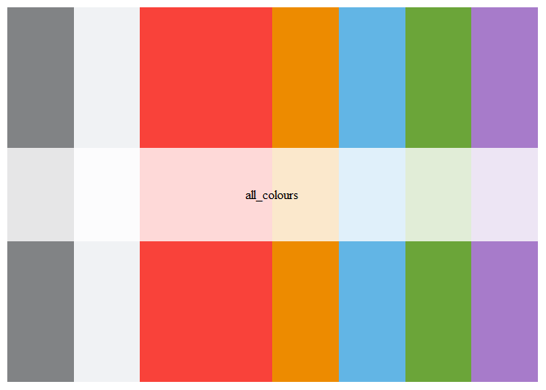
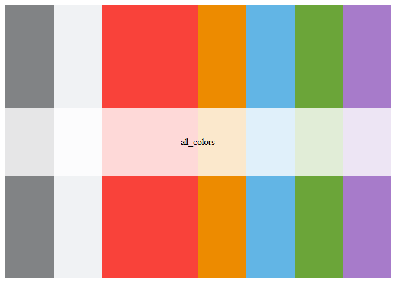
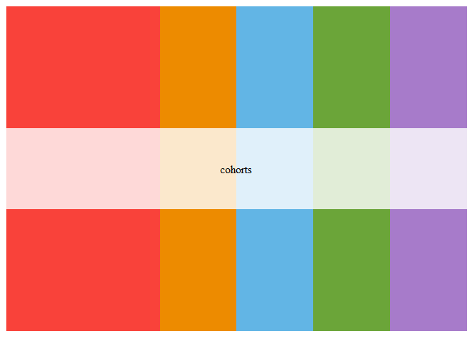
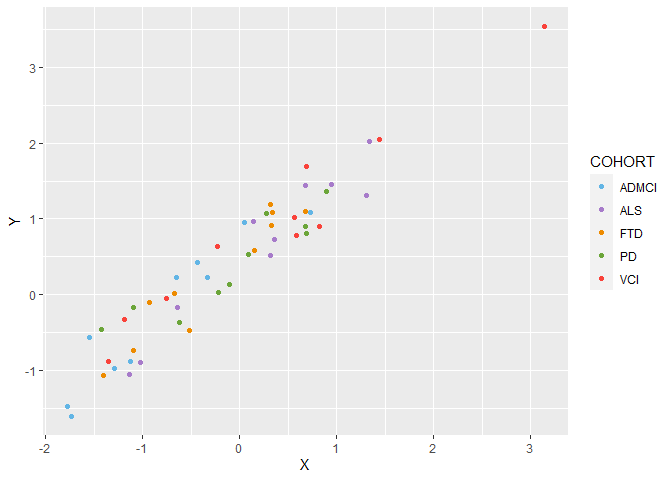
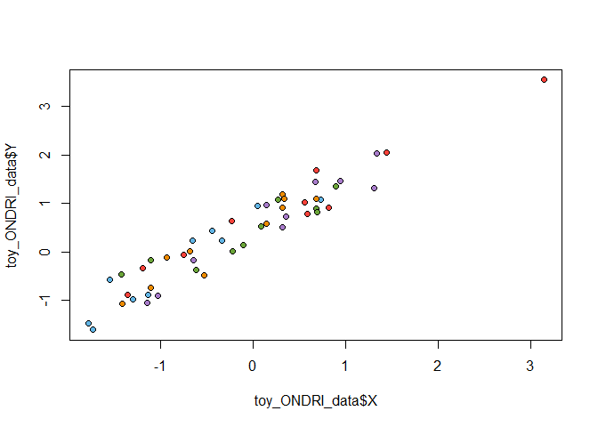

README
================
Derek Beaton & Jeremy Tanuan
2020SEP08

# **ONDRI Themes**

Standardized themes, colors, and templates for the ONDRI project’s
colors and presentations. Developed by Jeremy Tanuan and Derek
Beaton.The package is heavily influenced by and copies key parts of
[Karthik Ram’s `wesanderson` palette
package](https://github.com/karthik/wesanderson).

## **Installation**

Make sure you have [R](https://cran.r-project.org/) and
[RStudio](https://www.rstudio.com/products/rstudio/download/). Open
RStudio and run the following commands in the RStudio console (the
bottom left pane) to install the necessary packages if you have not
already done so.

First install the `ondricolors` package

``` r
if(!require('devtools')){
  devtools::install_github(repo = "ondri-nibs/ondricolors")
}
```

    ## Loading required package: devtools

    ## Loading required package: usethis

Then load the package as

``` r
library(ondricolors)
```

You will know that the packages are loaded if the checkbox beside each
in the *Packages* tab (the bottom right pane) are checked. Add the
checkmark to each for any that are missing from the necessary packages.

## **Palettes**

### **All colors**

Depending on your flavour (flavor) of English, we provide

``` r
ondri_palette("all_colours")
```

<!-- -->

or alternatively

``` r
ondri_palette("all_colors")
```

<!-- -->

### **Cohorts**

``` r
ondri_palette("cohorts")
```

<!-- -->

## **Usage and examples**

Let’s see the palette colors

``` r
# See all ONDRI palettes
names(ondri_palettes)
```

    ## [1] "all_colours" "all_colors"  "cohorts"

### A ggplot2 example

Here we provide an example with `ggplot2`.

``` r
library(ggplot2)
library(ondricolors)

data('toy_ONDRI_data')

ggp_color <- ggplot(toy_ONDRI_data, aes(x = X, y = Y, color = COHORT)) +
geom_point() +
scale_color_manual(values = ondri_palette("cohorts"))

ggp_color
```

<!-- -->

### A base R example

And here we provide an example with base `R`

``` r
library(ondricolors)
data('toy_ONDRI_data')

## for the filled pchs
plot(toy_ONDRI_data$X, toy_ONDRI_data$Y, col = ondri_palette("cohorts")[as.character(toy_ONDRI_data$COHORT)], pch = 20)
```

<!-- -->

``` r
## for the pchs with bgs
plot(toy_ONDRI_data$X, toy_ONDRI_data$Y, bg = ondri_palette("cohorts")[as.character(toy_ONDRI_data$COHORT)], pch = 21)
```

<!-- -->
